# Hermes for Geothermal Engineering

Hermes Agent course for **geothermal reservoir engineering**, adapted from the `hermes-reservoir-engineering` workflow framework.  Every exercise maps the same AI-assisted guardrail (explore-plan-code-verify-review) to real geothermal workflows: enthalpy balance, thermodynamic state validation, wellbore deliverability, tracer interpretation, scaling/precipitation screening, sustainability analysis, and parallel sensitivity studies.

The goal: teach geothermal engineers to direct AI like a disciplined technical assistant — context, constraints, units in SI, verification with tests, proven thermo libraries over hand-rolled formulas.

## Why This Course Exists

Geothermal engineering has its own set of high-consequence small details:

- thermodynamic properties: enthalpy, entropy, density, viscosity as functions of T and P
- phase changes: liquid, two-phase, vapor, and transitions across the saturation dome
- unit discipline: SI (kPa, C, kg/s) vs legacy (psia, degF, lb/hr)
- wellbore deliverability: IPR + TPR (wellbore flowing)
- chemistry: silica saturation, scaling indices, CO2/H2S degassing
- sustainability: reservoir pressure drawdown vs recharge, temperature decline
- simulation: mass/energy balance, boundary conditions, mesh, timestep stability
- uncertainty: natural state calibration vs production forecasting, parameter correlations

AI tools accelerate this work only when engineers demand domain context, SI units, known-value checks, and physical-bounds verification.  This course teaches that workflow concretely.

## What You Will Learn

By the end:

- use Hermes explore-plan-code-verify on geothermal scripts
- write prompts with file, function, SI units, and expected T-P-h relationship
- ask Hermes for tests: known IFE-97 values, monotonicity, physical bounds
- create `CLAUDE.md` / `AGENTS.md` with geothermal standards
- package repeatable workflows as Hermes skills
- run a reviewer subagent for unit consistency, correlation range, nonphysical output
- combine shell + Python for CSV/datalog QA before analysis
- use thermodynamic tools (CoolProp, iapws, geochem) via MCP or direct Python
- use pygeotoolbox-mcp for batch thermo, wellbore, scaling, and sensitivity calculations
- parallelize independent sensitivity cases (injectivity, drawdown, sustainability)

## Who This Is For

- geothermal reservoir engineers
- production engineers managing wellbore deliverability and scaling
- geothermal drilling / well-test engineers
- renewable energy data scientists in subsurface
- technical managers evaluating AI for geothermal workflows
- students / researchers in geothermal systems, volcanology, hydrogeology

No software engineering background needed.  Basic Python + terminal comfort is enough.

## Source Inspiration

- Original reservoir course: `Claude-for-reservoir-engineering` by Gabriel Serrao  
- Hermes port: `hermes-reservoir-engineering` by Zulfikar Aji Kusworo
- Companion toolbox: [pygeotoolbox-mcp](https://github.com/zakusworo/pygeotoolbox-mcp) — Geothermal engineering MCP server with 24 tools (thermo, saturation, transport, seawater, geophysics, wellbore, scaling, decline, heat balance, sensitivity) using CoolProp + IAPWS-IF97
- Waiwera simulator (Fortran/PETSc): insight into geothermal flow simulation structure  
- CoolProp and IAPWS-IF97 for reliable thermodynamic properties  
- Geochemist's Workbench / PHREEQC for geochemical calculations  

## Repository Structure

```text
.
|-- 01_explore_plan_code/           # Production enthalpy analysis
|-- 02_specific_context/            # Thermodynamic state bug fix
|-- 03_verify_your_work/            # Wellbore deliverability checks
|-- 04_init_project_memory/         # Geothermal project memory
|-- 05_skills/                      # Reusable Hermes geothermal skills
|-- 06_subagent_review/             # Reviewer subagent
|-- 07_cli_workflow/                # Shell + Python QA
|-- 08_mcp_geochem_thermo/          # CoolProp / IAPWS via MCP
|-- 09_parallel_fanout/             # Parallel sustainability studies
|-- 10_saturation_validation/       # IAPWS known-value tests
|-- 11_transport_verification/      # Physical trend verification
|-- 12_two_phase_wellbore/          # Phase transition analysis
|-- 13_coastal_geothermal/          # Seawater properties, offshore
|-- 14_geophysical_integration/     # Resistivity → salinity
|-- 15_supercooled_injection/       # IAPWS G12-15 cold reinjection
|-- scripts/generate_course_figures.py
|-- .hermes/skills/geothermal-engineering/  # Hermes geothermal skill (CoolProp, IPR, scaling)
|-- .hermes/skills/run-tests/              # Test skill
|-- AGENTS.md                        # Reviewer subagent prompt
|-- CLAUDE.md                        # Project rules
|-- BEGINNERS_GUIDE.txt             # Panduan awam (Bahasa Indonesia)
|-- requirements.txt
|-- LICENSE
|-- README.md
```

## Case Studies

The same explore–plan–code–verify workflow taught here was applied to **five
published geothermal field cases**, using
[pygeotoolbox-mcp](https://github.com/zakusworo/pygeotoolbox-mcp) as the tool
layer. Each case was first solved by an established/published method (the
"reference"), then re-solved by the agent with the toolbox; the two are
compared below. Boundary conditions are taken from the literature, and a
one-factor sensitivity sweep accompanies every case. All numbers are
reproduced by `cases/run_all.py` → `results/results.json` in the companion
study folder.

| # | Site | Country | Technology | Reference (other methods) | Framework | Match |
|---|------|---------|------------|---------------------------|-----------|-------|
| 1 | Wairakei | New Zealand | Triple-flash (liquid-dominated) | 161 MW | 162.6 MW | **101.0%** |
| 2 | Soultz-sous-Forêts | France | EGS + isobutane ORC | 1.5 MW | 1.43 MW | **95.5%** |
| 3 | Chena Hot Springs | USA (Alaska) | Low-T R134a binary ORC | 210 kW | 215 kW | **102.5%** |
| 4 | Hellisheidi | Iceland | Triple-flash (two-phase) | 303 MW | 301.0 MW | **99.3%** |
| 5 | Olkaria East | Kenya | Reservoir sustainability | 25 °C / centuries | 8.9 °C field-avg / ~745 yr | sustainability |

<p align="center">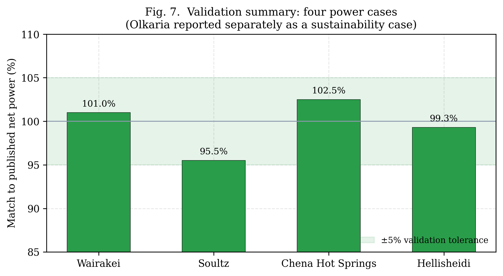</p>
<p align="center"><i>Validation summary for the four power cases; all fall within the ±5% tolerance band.</i></p>

**How agreement is framed.** To avoid overstating the result we distinguish:
*physics-prediction with bounded calibration* (Wairakei, Hellisheidi — only the
measured-uncertain wellhead enthalpy is calibrated within its field range),
*cycle-driven prediction* (Soultz, Chena — conversion efficiency emerges from a
closed ORC cycle, bounded by Carnot, not fitted), and a *deterministic balance*
(Olkaria).

### 1. Wairakei, New Zealand — liquid-dominated triple-flash

**Keterangan.** World's first large geothermal plant (1958). Liquid-dominated
geofluid at ~260 °C with 2.5% CO₂; modelled as a triple-flash plant
(260/180/140 °C, η_turbine = 0.83, water-cooled condenser) at 1250 kg/s with a
wellhead enthalpy of 1250 kJ/kg.

<p align="center">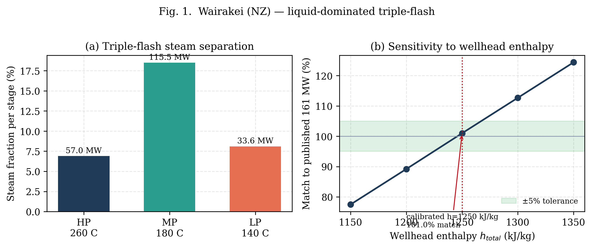</p>

| Quantity | Reference | Framework | Match |
|----------|-----------|-----------|-------|
| Net power (MW) | 161 | 162.6 | **101.0%** |
| Gross power (MW) | ~195 | 206.0 | — |
| Parasitic load | ~34 MW | 43.5 MW (21.1%) | — |
| Stage steam fraction HP/MP/LP | ~11/16/8% | 6.9/18.5/8.1% | — |

### 2. Soultz-sous-Forêts, France — EGS with an isobutane ORC

**Keterangan.** Reference EGS pilot in granitic basement (~200 °C, ~5000 m). The
toolbox first checks deliverability (IPR places the operating point at 25 kg/s),
then computes power from a closed isobutane ORC cycle (evaporator 125 °C, below
the isobutane critical temperature of 134.7 °C). The conversion efficiency is an
output of the cycle, not fitted to the published power.

<p align="center">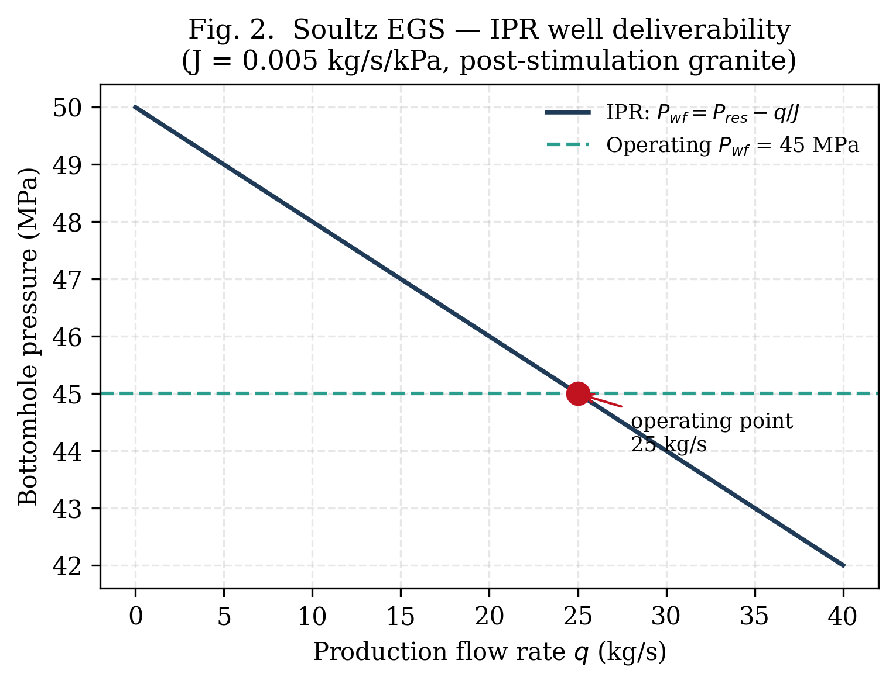 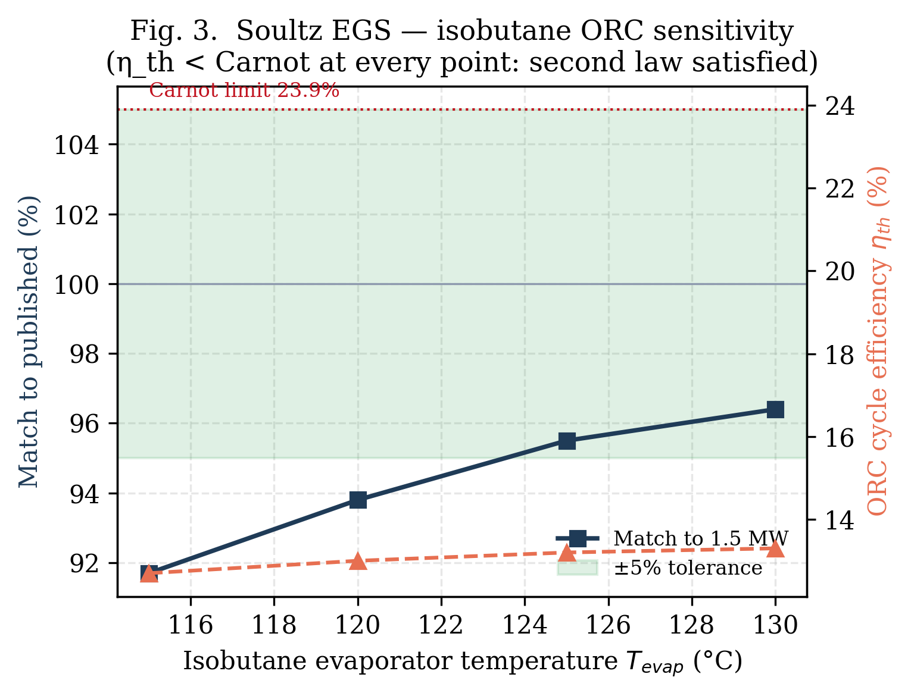</p>

| Quantity | Reference | Framework | Match |
|----------|-----------|-----------|-------|
| Net power (MW) | 1.5 | 1.43 | **95.5%** |
| Flow rate (kg/s) | 25 | 25 | 0% |
| ORC cycle efficiency | ~13–14% | 13.2% (< Carnot 23.9%) | — |

### 3. Chena Hot Springs, Alaska — low-temperature R134a binary ORC

**Keterangan.** The lowest-temperature commercial geothermal resource (73.3 °C),
driving R134a binary modules cooled by near-freezing creek water. R134a
evaporates at 70 °C, below its 101.1 °C critical point, so the subcritical ORC is
physically valid and its cycle efficiency stays below the Carnot limit.

<p align="center">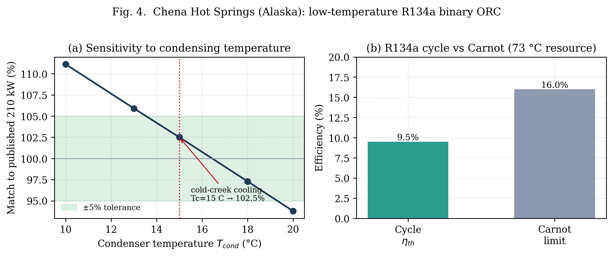</p>

| Quantity | Reference | Framework | Match |
|----------|-----------|-----------|-------|
| Net power (kW) | 210 | 215 | **102.5%** |
| Resource temperature (°C) | 73.3 | 73.3 | 0% |
| ORC cycle efficiency | ~8% | 9.5% (< Carnot 16.0%) | — |

### 4. Hellisheidi, Iceland — high-enthalpy two-phase triple-flash

**Keterangan.** One of the largest geothermal plants (303 MW), fed by
high-enthalpy two-phase wells. Modelled as triple-flash (220/170/120 °C,
η_turbine = 0.87, air-cooled) at 1300 kg/s with a two-phase wellhead enthalpy of
1500 kJ/kg (separator quality x ≈ 0.30).

<p align="center">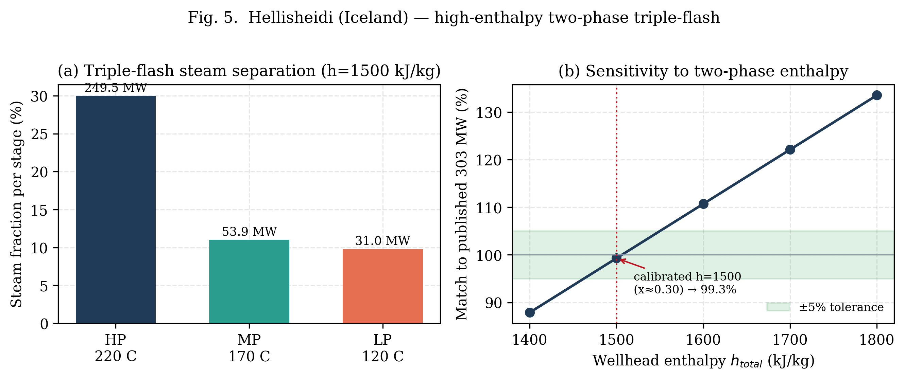</p>

| Quantity | Reference | Framework | Match |
|----------|-----------|-----------|-------|
| Net power (MW) | 303 | 301.0 | **99.3%** |
| Gross power (MW) | ~330–340 | 334.4 | — |
| Parasitic load | ~27–30 MW | 33.4 MW (10%) | — |
| Separator quality x | ~0.3 | 0.30 | — |

### 5. Olkaria East, Kenya — reservoir sustainability

**Keterangan.** Producing since 1981; the ~25 °C near-well temperature decline
over 30 years is the classic sustainability benchmark. A lumped whole-field
energy balance reproduces the *field-average* behaviour and the sustainability
conclusion (we are explicit that the localized 25 °C near-well decline is not
resolved by a single-tank model).

<p align="center">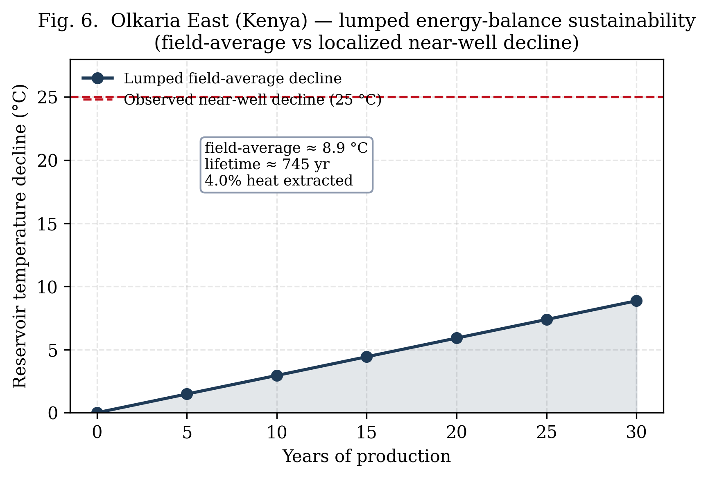</p>

| Quantity | Reference / observed | Framework | Note |
|----------|----------------------|-----------|------|
| Extraction rate (MW) | ~200 | 204.8 | energy balance |
| 30-yr decline (°C) | 25 (near-well) | 8.9 (field-average) | localized vs lumped |
| Thermal lifetime (yr) | centuries | ~745 | sustainable |
| Heat extracted in 30 yr | small | 4.0% | sustainable |

### The VERIFY stage

The case studies show why the **VERIFY** stage matters. Every result is held to
two tests: the match against published output, and first-principles physics
checks. A cycle efficiency must stay below its Carnot limit, a working fluid is
only evaporated below its critical temperature, and exhaust qualities must be
physical. A case returns to PLAN until both the match and the physics checks are
met. This is the central lesson of the course: AI tool outputs are trustworthy
only when they are checked against the physics they claim to represent.

**Use a different model for VERIFY.** The verification stage should be driven by a
different LLM or agent than the one that wrote the code or ran the analysis. A
model is weak at catching its own mistakes, because it shares the blind spots
that produced them; an independent model finds far more. In practice we authored
workflows with Hermes driving Kimi-2.6 and verified them with a separate agent
(Claude Code, Opus 4.7), which surfaced errors the authoring model had missed.
Treat VERIFY as an adversarial cross-model review, not a self-check, and record
which model authored and which verified each result.

<p align="center">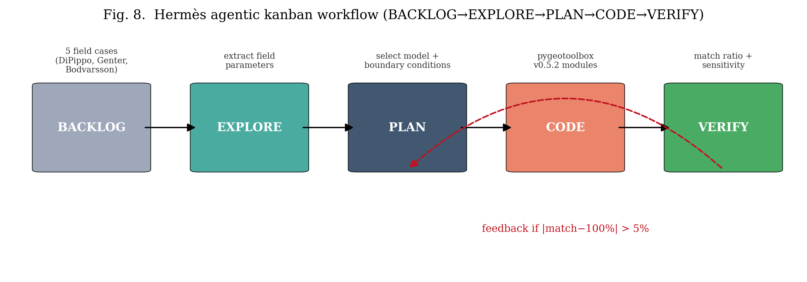</p>

## Prerequisites

- Hermes Agent: https://hermes-agent.nousresearch.com/docs/
- Python 3.10+ and `pip`
- `coolprop`, `iapws`, `matplotlib`, `numpy`, `pandas`, `pytest`, `pygeotoolbox-mcp`
- Optional: `phreeqpy` or `geochem` for Module 8
- Optional: WSL or Linux for shell workflows

## Quick Start

```bash
git clone https://github.com/zakusworo/hermes-geothermal-engineering.git
cd hermes-geothermal-engineering
python3 -m pip install -r requirements.txt
python3 scripts/generate_course_figures.py
hermes
```

Navigate to Exercise 1:

```bash
cd 01_explore_plan_code
```

Read README, try vague prompt first, /clear, then improved prompt.  Contrast is the point.

## Hermes vs Claude Code

| Feature | Claude Code | Hermes Agent |
|---------|-------------|--------------|
| Explore/plan/code/verify | Yes | Yes, plus `/skill` preloading |
| Project memory | `CLAUDE.md` | `CLAUDE.md` + `AGENTS.md` + `.hermes/skills/` |
| Skills | `.claude/skills/` | `.hermes/skills/` — loaded with `/skill` |
| Subagent review | Reviewer agent | `delegate_task` — isolated subagent |
| Cron/scheduled tasks | Not built-in | `/cron` — recurring analysis |
| Web search | Not built-in | `/web_search` built-in |
| Memory across sessions | Manual | Persistent via `/memory` |
| CLI approvals | `--yolo` | `hermes config set approvals.mode manual` (default) |
| WSL/Windows native | Yes | Yes, with `/mnt/c/` paths |

All exercises mapped to Hermes tool model: `terminal()`, `browser_navigate()`, `delegate_task()`, `cronjob()`, `web_search()`, `skill_view()`.

## Course Modules

| # | Folder | Hermes Practice | Geothermal Engineering Focus |
|---|--------|-----------------|------------------------------|
| 1 | `01_explore_plan_code/` | Explore->Plan->Code | Separator enthalpy analysis and temperature trend |
| 2 | `02_specific_context/` | Exact file/function/unit context | Fixing thermodynamic state (h, rho, s from T,P) |
| 3 | `03_verify_your_work/` | Test as quality gate | Wellbore deliverability: IPR + TPR, physical bounds |
| 4 | `04_init_project_memory/` | `CLAUDE.md`/`AGENTS.md` | Geothermal standards (SI, saturation checks, mesh rules) |
| 5 | `05_skills/` | Reusable domain skills | Geothermal-engineering skill (IAPWS, IPR, scaling) |
| 6 | `06_subagent_review/` | `delegate_task` reviewer | Unit consistency, IAPWS range, nonphysical output |
| 7 | `07_cli_workflow/` | Shell + Python QA | Timeseries CSV QA: NaN, out-of-range T/P, duplicates |
| 8 | `08_mcp_geochem_thermo/` | MCP tools (CoolProp, IAPWS) | Live thermodynamic calls + geochemical checks |
| 9 | `09_parallel_fanout/` | Parallel sensitivity | Sustainability, drawdown, injectivity scenarios |
| 10 | `10_saturation_validation/` | IAPWS known-value tests | Validate T(P), P(T), steam quality at standard points |
| 11 | `11_transport_verification/` | Physical trend verification | Thermal conductivity, viscosity, Prandtl number |
| 12 | `12_two_phase_wellbore/` | Phase transition analysis | Single-phase vs two-phase flow regime |
| 13 | `13_coastal_geothermal/` | Seawater properties | Density, heat extraction, offshore geothermal |
| 14 | `14_geophysical_integration/` | Resistivity → salinity | Geophysical exploration, anomalous zone detection |
| 15 | `15_supercooled_injection/` | Injection below 0 °C | IAPWS G12-15 cold reinjection heat sink |

## Illustrated Outputs

Run `python3 scripts/generate_course_figures.py` to regenerate.

|| Graph | File | Description |
|-------|------|-------------|
| Separator Enthalpy & Temperature | `separator_enthalpy_temperature.png` | Steam/water enthalpy fractions and separator temperature trend |
| Thermodynamic State Surface | `thermo_state_surface.png` | Density and enthalpy contours in T-P space (IAPWS-IF97) |
| Wellbore Deliverability | `wellbore_deliverability.png` | IPR + TPR intersection; mass flow vs wellhead pressure |
| Supercooled Water Density | `supercooled_density.png` | IAPWS G12-15: density and enthalpy trends for −22 to 0 °C |
| Seawater Density | `seawater_density.png` | IAPWS G14-19: density vs salinity and temperature |
| Transport Properties | `transport_properties.png` | Thermal conductivity and viscosity across IAPWS range |
| Humid Air Properties | `humid_air.png` | IAPWS G11-15: density and enthalpy for cooling tower design |
| Geothermal Workflow Map | `hermes_geothermal_workflow.png` | 5-step guardrail applied to geothermal |

### Separator Enthalpy Diagnostic


- Well A: higher enthalpy, lower mass fraction increase (7% to 12%)
- Well B: lower enthalpy, wetter trend, fraction increase (21% to 28%)
- A good prompt: "compute enthalpy from T,P; is separator temperature stable, monotonically decreasing, or oscillating?"

### Thermodynamic State Surface


- Density drops sharply near boiling point at each pressure level.
- Enthalpy increases with temperature but bends approaching saturation.
- Phase-transition boundary visible as kink.  Any tool that produces a smooth surface crossing the saturation line without discontinuity is suspect.

### Wellbore Deliverability


- IPR (Inflow Performance Relationship): mass flow vs flowing pressure
- TPR (Tubing Performance Relationship): mass flow vs wellhead pressure (includes friction, elevation)
- Operating point: IPR = TPR, within physical bounds (flow > 0, P_wf < P_res)

### Supercooled Water

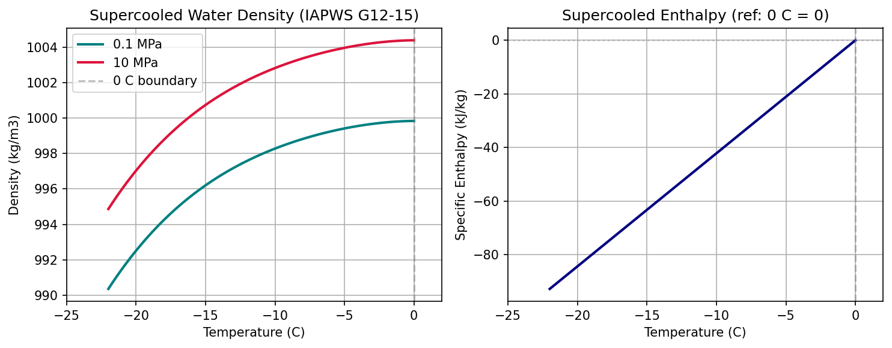

- IAPWS G12-15 covers metastable liquid water from −22 to 0 °C.
- Left: density decreases with cooling (water expands when supercooled).
- Right: enthalpy becomes negative below 0 °C (reference at 0 °C liquid = 0).
- Critical for EGS cold reinjection: colder brine = larger heat sink.

### Seawater Density

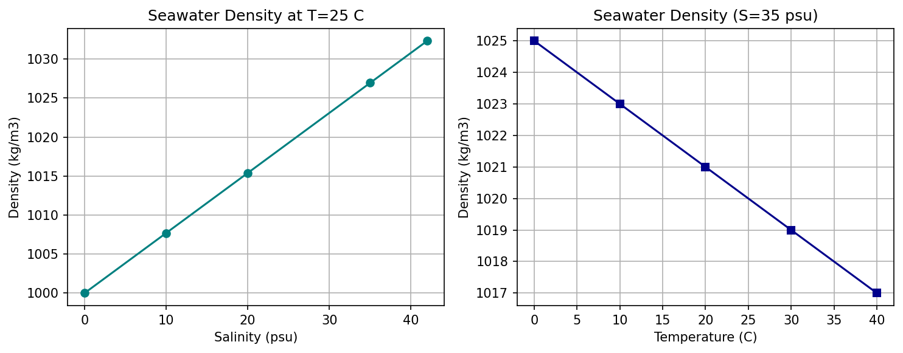

- IAPWS G14-19: density increases with salinity (~0.77 kg/m³ per psu).
- Density decreases with temperature (thermal expansion).
- Offshore/coastal geothermal: brine density determines stratification and circulation.

### Transport Properties

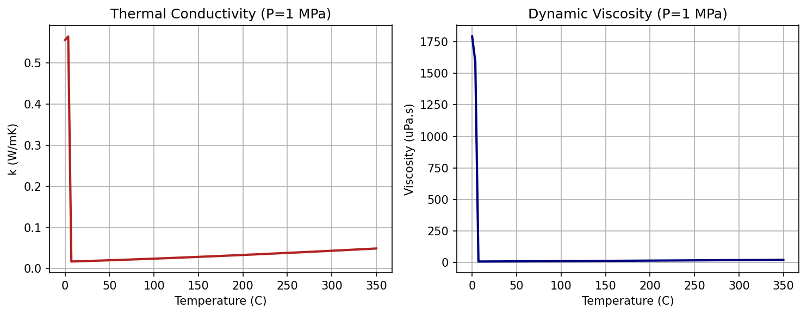

- IAPWS-IF97 release on thermal conductivity and viscosity.
- Thermal conductivity peaks near boiling, then flattens in supercritical region.
- Viscosity drops dramatically with temperature (affects friction losses).
- Used for heat-exchanger sizing and wellbore pressure-drop calculations.

### Humid Air

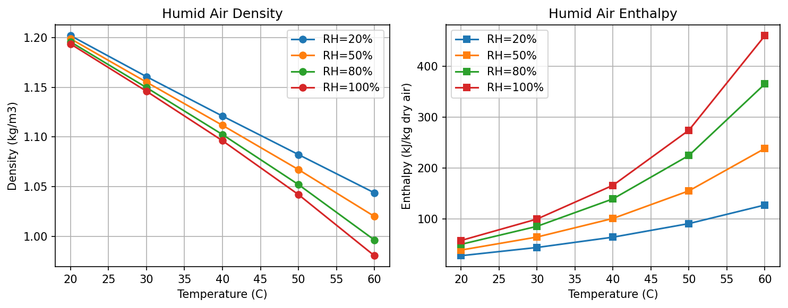

- IAPWS G11-15: humid air properties for cooling tower and gas-extraction design.
- Density decreases with both temperature and humidity (water vapor is lighter than dry air).
- Enthalpy increases strongly with humidity (latent heat of evaporation).
- Dew point marks the condensation boundary for cooling tower operation.

### Geothermal Workflow Map

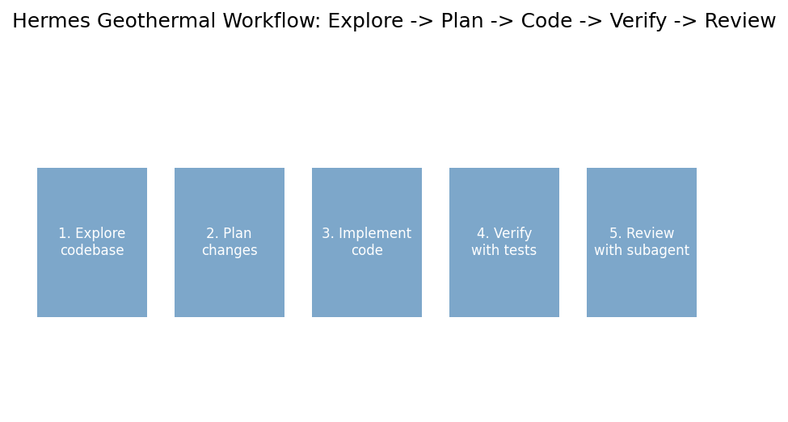

- 5-step guardrail: Explore -> Plan -> Implement -> Verify -> Review
- Applied to geothermal engineering exercises in this repository
- Each exercise follows this pattern explicitly

## Key Hermes Commands

```text
hermes                              # start session
hermes -w                           # isolated worktree
hermes -s geothermal-engineering    # preload skill
/skill geothermal-engineering         # load within session
/skill run-tests                    # load test skill
/init                               # reload CLAUDE.md rules
/delegate_task                      # spawn reviewer subagent
/cron                               # schedule recurring analysis
/agents                             # list subagents
/memory add                         # save note across sessions
/web_search                         # search web for latest references
```

## Running Tests

```bash
python3 -m pytest -v
python3 -m pytest 01_explore_plan_code/ -v
python3 -m pytest pygeotoolbox-mcp/tests/ -v  # if installed from source
```

Tests are teaching tools.  Add real-edge cases and known IAPWS-IF97 reference values for production use.

## Using CoolProp / IAPWS-IF97

```python
from CoolProp.CoolProp import PropsSI

h = PropsSI('H', 'T', 473.15, 'P', 2.0e6, 'Water')  # J/kg
rho = PropsSI('D', 'T', 473.15, 'P', 2.0e6, 'Water')  # kg/m3
```

Always capture: inputs T [K] or [C], P [Pa] or [kPa], phase expectation, output units, sanity check (rho > 0, h > h_f at that P).

## Using IAPWS directly

```python
from iapws import IAPWS97

sat = IAPWS97(T=473.15, x=0.5)   # two-phase at 200 C
h = sat.h                          # kJ/kg
rho = sat.rho                      # kg/m3
```

- IAPWS97 expects T in K and P in MPa
- Always verify input is within valid range (T < 1273 K, P < 100 MPa)
- Never silently assume single phase if T,P is near saturation dome

## Using pygeotoolbox-mcp (recommended)

This course ships with **[pygeotoolbox-mcp](https://github.com/zakusworo/pygeotoolbox-mcp)**, a dedicated geothermal MCP server inspired by the structure of pyrestoolbox-mcp but reimplemented from scratch for geothermal engineering.

**Install:**
```bash
pip install git+https://github.com/zakusworo/pygeotoolbox-mcp.git
```

**Register in Hermes:**
```yaml
mcp_servers:
  pygeotoolbox:
    command: fastmcp run /path/to/pygeotoolbox-mcp/src/pygeotoolbox/mcp_server.py
    transport: stdio
```

**What it provides:**
- **Thermo** — enthalpy, density, viscosity, cp, conductivity, phase, saturation temperature, batch properties
- **Wellbore** — IPR, TPR, operating point, productivity index
- **Scaling** — CaCO3 RSI, SiO2 scaling risk, corrosivity index
- **Decline** — exponential, hyperbolic, reinjection temperature model
- **Heat Balance** — reservoir heat, thermal recovery, power output, NPV
- **Sensitivity** — Monte Carlo, one-factor sweep, tornado charts, rank correlation

Recommended response format for any calculation:

```text
Inputs:
- Temperature: 200 C (473.15 K)
- Pressure: 2000 kPa (2.0 MPa)

Method:
- IAPWS-IF97 / CoolProp / correlation

Result:
- Enthalpy: 852.3 kJ/kg
- Density: 862.1 kg/m3

Sanity check:
- 200 C, 2 MPa is single-phase liquid (saturated T at 2 MPa = 212.4 C, so subcooled)
- Density positive, enthalpy between h_f and h_g at that pressure
- Not crossing saturation dome

Assumptions:
- Pure water, not brine
- No dissolved gas effect on density
- Single phase (subcooled liquid)
```

## Security Note

```bash
hermes config set approvals.mode manual   # default
# CI/batch: --yolo
```

Hermes runs shell via `terminal()`.  Exercises intentionally allow `python`, `pytest`, `uv run`.

## Contributing

Pattern:

1. Add numbered exercise folder.
2. Include README.md with before/after prompts.
3. Include Python file + tests.
4. Keep sample data fictional or openly licensed.
5. Add figure generation to `scripts/generate_course_figures.py`.

## License

MIT License. See `LICENSE`.

- Copyright (c) 2025 Gabriel Serrao (original petroleum reservoir course)
- Copyright (c) 2026 Zulfikar Aji Kusworo — Hermes port, rewrite, figures, packaging, and geothermal adaptation.

## Acknowledgements

- **Claude Code ecosystem** + `claude-code-for-hydrology` — original inspiration for AI-assisted engineering workflows
- **pyResToolbox** (Mark Burgoyne) — petroleum engineering PVT/nodal/DCA library (GPL-3.0); its module structure inspired the layout of this geothermal toolbox, but all implementation here is new
- **pyrestoolbox-mcp** (Gabriel Serrao) — MCP server wrapper for pyResToolbox; inspired the FastMCP tool registry design in pygeotoolbox-mcp, with tools reimplemented for geothermal domain
- **Waiwera geothermal simulator** (University of Auckland) — insight into geothermal flow simulation structure and mesh/timestep conventions
- **IAPWS-IF97 formulation** and **CoolProp** — international standard for water/steam thermodynamic properties
- **Nous Research Hermes Agent** — the platform that makes this entire guardrail-driven workflow possible
