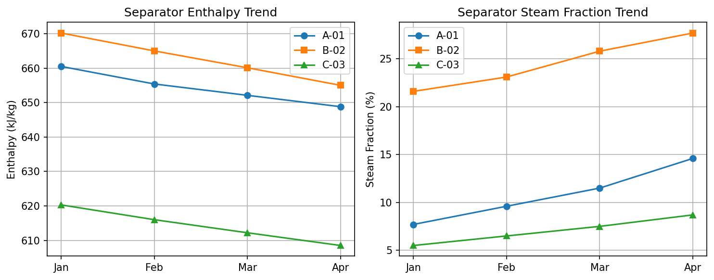
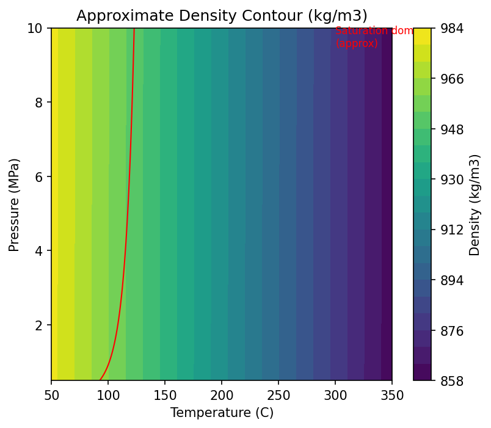
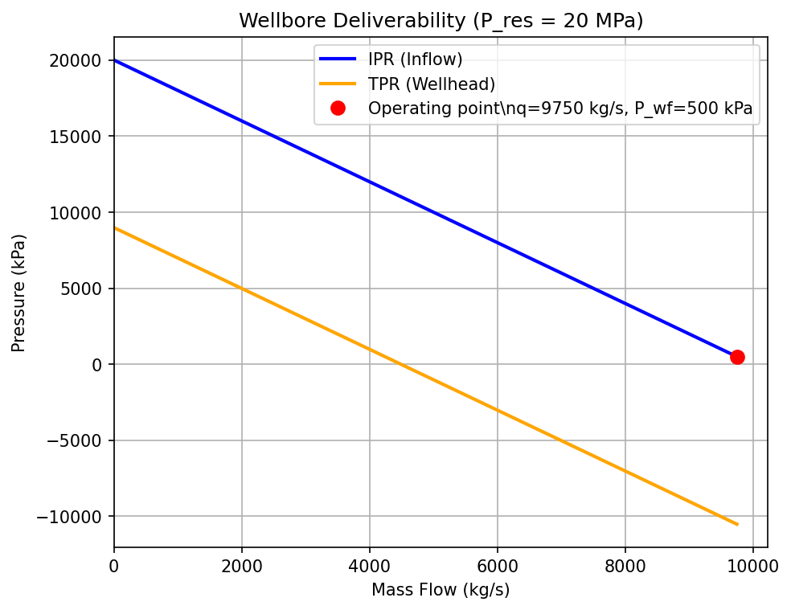

# Hermes for Geothermal Engineering

Hermes Agent course for **geothermal reservoir engineering**, adapted from the `hermes-reservoir-engineering` workflow framework.  Every exercise maps the same AI-assisted guardrail (explore-plan-code-verify-review) to real geothermal workflows: enthalpy balance, thermodynamic state validation, wellbore deliverability, tracer interpretation, scaling/precipitation screening, sustainability analysis, and parallel sensitivity studies.

The goal: teach geothermal engineers to direct AI like a disciplined technical assistant — context, constraints, units in SI, verification with tests, proven thermo libraries over hand-rolled formulas.

## Why This Course Exists

Geothermal engineering has its own set of high-consequence small details:

- thermodynamic properties: enthalpy, entropy, density, viscosity as functions of T and P
- phase changes: liquid, two-phase, vapor, and transitions across the saturation dome
- unit discipline: SI (kPa, C, kg/s) vs legacy (psia, degF, lb/hr)
- wellbore deliverability: IPR + TPR (wellbore flowing)
- chemistry: silica saturation, scaling indices, CO2/H2S degassing
- sustainability: reservoir pressure drawdown vs recharge, temperature decline
- simulation: mass/energy balance, boundary conditions, mesh, timestep stability
- uncertainty: natural state calibration vs production forecasting, parameter correlations

AI tools accelerate this work only when engineers demand domain context, SI units, known-value checks, and physical-bounds verification.  This course teaches that workflow concretely.

## What You Will Learn

By the end:

- use Hermes explore-plan-code-verify on geothermal scripts
- write prompts with file, function, SI units, and expected T-P-h relationship
- ask Hermes for tests: known IFE-97 values, monotonicity, physical bounds
- create `CLAUDE.md` / `AGENTS.md` with geothermal standards
- package repeatable workflows as Hermes skills
- run a reviewer subagent for unit consistency, correlation range, nonphysical output
- combine shell + Python for CSV/datalog QA before analysis
- use thermodynamic tools (CoolProp, iapws, geochem) via MCP or direct Python
- use pygeotoolbox-mcp for batch thermo, wellbore, scaling, and sensitivity calculations
- parallelize independent sensitivity cases (injectivity, drawdown, sustainability)

## Who This Is For

- geothermal reservoir engineers
- production engineers managing wellbore deliverability and scaling
- geothermal drilling / well-test engineers
- renewable energy data scientists in subsurface
- technical managers evaluating AI for geothermal workflows
- students / researchers in geothermal systems, volcanology, hydrogeology

No software engineering background needed.  Basic Python + terminal comfort is enough.

## Source Inspiration

- Original reservoir course: `Claude-for-reservoir-engineering` by Gabriel Serrao  
- Hermes port: `hermes-reservoir-engineering` by Zulfikar Aji Kusworo
- Companion toolbox: [pygeotoolbox-mcp](https://github.com/zakusworo/pygeotoolbox-mcp) — Geothermal engineering MCP server with 24 tools (thermo, saturation, transport, seawater, geophysics, wellbore, scaling, decline, heat balance, sensitivity) using CoolProp + IAPWS-IF97
- Waiwera simulator (Fortran/PETSc): insight into geothermal flow simulation structure  
- CoolProp and IAPWS-IF97 for reliable thermodynamic properties  
- Geochemist's Workbench / PHREEQC for geochemical calculations  

## Repository Structure

```text
.
|-- 01_explore_plan_code/           # Production enthalpy analysis
|-- 02_specific_context/            # Thermodynamic state bug fix
|-- 03_verify_your_work/            # Wellbore deliverability checks
|-- 04_init_project_memory/         # Geothermal project memory
|-- 05_skills/                      # Reusable Hermes geothermal skills
|-- 06_subagent_review/             # Reviewer subagent
|-- 07_cli_workflow/                # Shell + Python QA
|-- 08_mcp_geochem_thermo/          # CoolProp / IAPWS via MCP
|-- 09_parallel_fanout/             # Parallel sustainability studies
|-- 10_saturation_validation/       # IAPWS known-value tests
|-- 11_transport_verification/      # Physical trend verification
|-- 12_two_phase_wellbore/          # Phase transition analysis
|-- 13_coastal_geothermal/          # Seawater properties, offshore
|-- 14_geophysical_integration/     # Resistivity → salinity
|-- scripts/generate_course_figures.py
|-- .hermes/skills/geothermal-engineering/  # Hermes geothermal skill (CoolProp, IPR, scaling)
|-- .hermes/skills/run-tests/              # Test skill
|-- AGENTS.md                        # Reviewer subagent prompt
|-- CLAUDE.md                        # Project rules
|-- BEGINNERS_GUIDE.txt             # Panduan awam (Bahasa Indonesia)
|-- requirements.txt
|-- LICENSE
|-- README.md
```

## Prerequisites

- Hermes Agent: https://hermes-agent.nousresearch.com/docs/
- Python 3.10+ and `pip`
- `coolprop`, `iapws`, `matplotlib`, `numpy`, `pandas`, `pytest`, `pygeotoolbox-mcp`
- Optional: `phreeqpy` or `geochem` for Module 8
- Optional: WSL or Linux for shell workflows

## Quick Start

```bash
git clone https://github.com/zakusworo/hermes-geothermal-engineering.git
cd hermes-geothermal-engineering
python3 -m pip install -r requirements.txt
python3 scripts/generate_course_figures.py
hermes
```

Navigate to Exercise 1:

```bash
cd 01_explore_plan_code
```

Read README, try vague prompt first, /clear, then improved prompt.  Contrast is the point.

## Hermes vs Claude Code

| Feature | Claude Code | Hermes Agent |
|---------|-------------|--------------|
| Explore/plan/code/verify | Yes | Yes, plus `/skill` preloading |
| Project memory | `CLAUDE.md` | `CLAUDE.md` + `AGENTS.md` + `.hermes/skills/` |
| Skills | `.claude/skills/` | `.hermes/skills/` — loaded with `/skill` |
| Subagent review | Reviewer agent | `delegate_task` — isolated subagent |
| Cron/scheduled tasks | Not built-in | `/cron` — recurring analysis |
| Web search | Not built-in | `/web_search` built-in |
| Memory across sessions | Manual | Persistent via `/memory` |
| CLI approvals | `--yolo` | `hermes config set approvals.mode manual` (default) |
| WSL/Windows native | Yes | Yes, with `/mnt/c/` paths |

All exercises mapped to Hermes tool model: `terminal()`, `browser_navigate()`, `delegate_task()`, `cronjob()`, `web_search()`, `skill_view()`.

## Course Modules

| # | Folder | Hermes Practice | Geothermal Engineering Focus |
|---|--------|-----------------|------------------------------|
| 1 | `01_explore_plan_code/` | Explore->Plan->Code | Separator enthalpy analysis and temperature trend |
| 2 | `02_specific_context/` | Exact file/function/unit context | Fixing thermodynamic state (h, rho, s from T,P) |
| 3 | `03_verify_your_work/` | Test as quality gate | Wellbore deliverability: IPR + TPR, physical bounds |
| 4 | `04_init_project_memory/` | `CLAUDE.md`/`AGENTS.md` | Geothermal standards (SI, saturation checks, mesh rules) |
| 5 | `05_skills/` | Reusable domain skills | Geothermal-engineering skill (IAPWS, IPR, scaling) |
| 6 | `06_subagent_review/` | `delegate_task` reviewer | Unit consistency, IAPWS range, nonphysical output |
| 7 | `07_cli_workflow/` | Shell + Python QA | Timeseries CSV QA: NaN, out-of-range T/P, duplicates |
| 8 | `08_mcp_geochem_thermo/` | MCP tools (CoolProp, IAPWS) | Live thermodynamic calls + geochemical checks |
| 9 | `09_parallel_fanout/` | Parallel sensitivity | Sustainability, drawdown, injectivity scenarios |
| 10 | `10_saturation_validation/` | IAPWS known-value tests | Validate T(P), P(T), steam quality at standard points |
| 11 | `11_transport_verification/` | Physical trend verification | Thermal conductivity, viscosity, Prandtl number |
| 12 | `12_two_phase_wellbore/` | Phase transition analysis | Single-phase vs two-phase flow regime |
| 13 | `13_coastal_geothermal/` | Seawater properties | Density, heat extraction, offshore geothermal |
| 14 | `14_geophysical_integration/` | Resistivity-salinity inversion | Geophysical exploration, anomalous zone detection |

## Illustrated Outputs

Run `python3 scripts/generate_course_figures.py` to regenerate.

| Graph | File | Description |
|-------|------|-------------|
| Separator Enthalpy & Temperature | `separator_enthalpy_temperature.png` | Steam/water enthalpy fractions and separator temperature trend |
| Thermodynamic State Surface | `thermo_state_surface.png` | Density and enthalpy contours in T-P space (IAPWS-IF97) |
| Wellbore Deliverability | `wellbore_deliverability.png` | IPR + TPR intersection; mass flow vs wellhead pressure |
| Geothermal Workflow Map | `hermes_geothermal_workflow.png` | 5-step guardrail applied to geothermal |

### Separator Enthalpy Diagnostic



- Well A: higher enthalpy, lower mass fraction increase (7% to 12%)
- Well B: lower enthalpy, wetter trend, fraction increase (21% to 28%)
- A good prompt: "compute enthalpy from T,P; is separator temperature stable, monotonically decreasing, or oscillating?"

### Thermodynamic State Surface



- Density drops sharply near boiling point at each pressure level.
- Enthalpy increases with temperature but bends approaching saturation.
- Phase-transition boundary visible as kink.  Any tool that produces a smooth surface crossing the saturation line without discontinuity is suspect.

### Wellbore Deliverability



- IPR (Inflow Performance Relationship): mass flow vs flowing pressure
- TPR (Tubing Performance Relationship): mass flow vs wellhead pressure (includes friction, elevation)
- Operating point: IPR = TPR, within physical bounds (flow > 0, P_wf < P_res)

## Key Hermes Commands

```text
hermes                              # start session
hermes -w                           # isolated worktree
hermes -s geothermal-engineering    # preload skill
/skill geothermal-engineering         # load within session
/skill run-tests                    # load test skill
/init                               # reload CLAUDE.md rules
/delegate_task                      # spawn reviewer subagent
/cron                               # schedule recurring analysis
/agents                             # list subagents
/memory add                         # save note across sessions
/web_search                         # search web for latest references
```

## Running Tests

```bash
python3 -m pytest -v
python3 -m pytest 01_explore_plan_code/ -v
python3 -m pytest pygeotoolbox-mcp/tests/ -v  # if installed from source
```

Tests are teaching tools.  Add real-edge cases and known IAPWS-IF97 reference values for production use.

## Using CoolProp / IAPWS-IF97

```python
from CoolProp.CoolProp import PropsSI

h = PropsSI('H', 'T', 473.15, 'P', 2.0e6, 'Water')  # J/kg
rho = PropsSI('D', 'T', 473.15, 'P', 2.0e6, 'Water')  # kg/m3
```

Always capture: inputs T [K] or [C], P [Pa] or [kPa], phase expectation, output units, sanity check (rho > 0, h > h_f at that P).

## Using IAPWS directly

```python
from iapws import IAPWS97

sat = IAPWS97(T=473.15, x=0.5)   # two-phase at 200 C
h = sat.h                          # kJ/kg
rho = sat.rho                      # kg/m3
```

- IAPWS97 expects T in K and P in MPa
- Always verify input is within valid range (T < 1273 K, P < 100 MPa)
- Never silently assume single phase if T,P is near saturation dome

## Using pygeotoolbox-mcp (recommended)

This course ships with **[pygeotoolbox-mcp](https://github.com/zakusworo/pygeotoolbox-mcp)**, a dedicated geothermal MCP server inspired by the structure of pyrestoolbox-mcp but reimplemented from scratch for geothermal engineering.

**Install:**
```bash
pip install git+https://github.com/zakusworo/pygeotoolbox-mcp.git
```

**Register in Hermes:**
```yaml
mcp_servers:
  pygeotoolbox:
    command: fastmcp run /path/to/pygeotoolbox-mcp/src/pygeotoolbox/mcp_server.py
    transport: stdio
```

**What it provides:**
- **Thermo** — enthalpy, density, viscosity, cp, conductivity, phase, saturation temperature, batch properties
- **Wellbore** — IPR, TPR, operating point, productivity index
- **Scaling** — CaCO3 RSI, SiO2 scaling risk, corrosivity index
- **Decline** — exponential, hyperbolic, reinjection temperature model
- **Heat Balance** — reservoir heat, thermal recovery, power output, NPV
- **Sensitivity** — Monte Carlo, one-factor sweep, tornado charts, rank correlation

Recommended response format for any calculation:

```text
Inputs:
- Temperature: 200 C (473.15 K)
- Pressure: 2000 kPa (2.0 MPa)

Method:
- IAPWS-IF97 / CoolProp / correlation

Result:
- Enthalpy: 852.3 kJ/kg
- Density: 862.1 kg/m3

Sanity check:
- 200 C, 2 MPa is single-phase liquid (saturated T at 2 MPa = 212.4 C, so subcooled)
- Density positive, enthalpy between h_f and h_g at that pressure
- Not crossing saturation dome

Assumptions:
- Pure water, not brine
- No dissolved gas effect on density
- Single phase (subcooled liquid)
```

## Security Note

```bash
hermes config set approvals.mode manual   # default
# CI/batch: --yolo
```

Hermes runs shell via `terminal()`.  Exercises intentionally allow `python`, `pytest`, `uv run`.

## Contributing

Pattern:

1. Add numbered exercise folder.
2. Include README.md with before/after prompts.
3. Include Python file + tests.
4. Keep sample data fictional or openly licensed.
5. Add figure generation to `scripts/generate_course_figures.py`.

## License

MIT License. See `LICENSE`.

- Copyright (c) 2025 Gabriel Serrao (original petroleum reservoir course)
- Copyright (c) 2026 Zulfikar Aji Kusworo — Hermes port, rewrite, figures, packaging, and geothermal adaptation.

## Acknowledgements

- **Claude Code ecosystem** + `claude-code-for-hydrology` — original inspiration for AI-assisted engineering workflows
- **pyResToolbox** (Mark Burgoyne) — petroleum engineering PVT/nodal/DCA library (GPL-3.0); its module structure inspired the layout of this geothermal toolbox, but all implementation here is new
- **pyrestoolbox-mcp** (Gabriel Serrao) — MCP server wrapper for pyResToolbox; inspired the FastMCP tool registry design in pygeotoolbox-mcp, with tools reimplemented for geothermal domain
- **Waiwera geothermal simulator** (University of Auckland) — insight into geothermal flow simulation structure and mesh/timestep conventions
- **IAPWS-IF97 formulation** and **CoolProp** — international standard for water/steam thermodynamic properties
- **Nous Research Hermes Agent** — the platform that makes this entire guardrail-driven workflow possible
